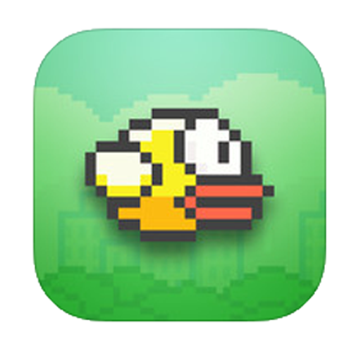
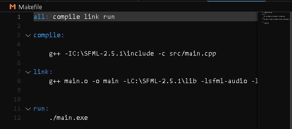
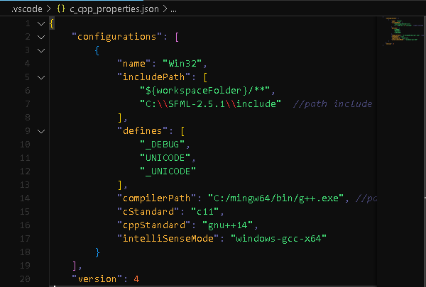

# Flappy Bird Remake !
remake do jogo flappy bird utilizado a [SFML lib](https://www.sfml-dev.org/index.php) com c++

## Branch baseada em Windows 
- <strong>Como Rodar?</strong> 

1- baixe o mingw e a lib sfml nas versões corretas:

- [SFML](https://www.sfml-dev.org/index.php)

- [MinGW](https://www.mingw-w64.org)

2- abra sua IDE com a pasta fonte e configure o makefile:
 
Atualize o path do seu SFML, colocando o \include no compile e o \lib no link   

3- Edite o c_cpp_properties.json

siga os comentarios e adicione os paths referentes

<strong> obs: caso necessário, linke o path da sfml e do compilador g++